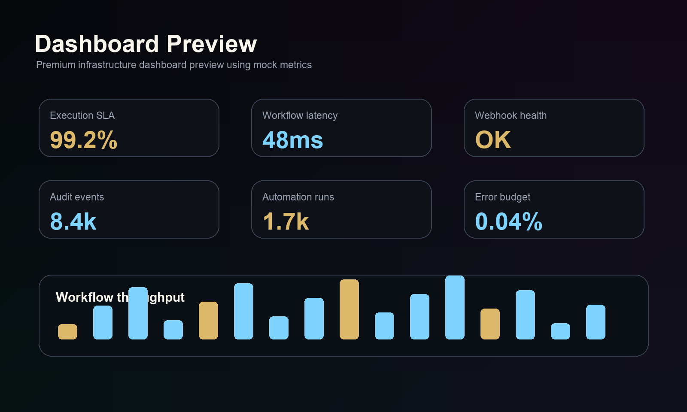
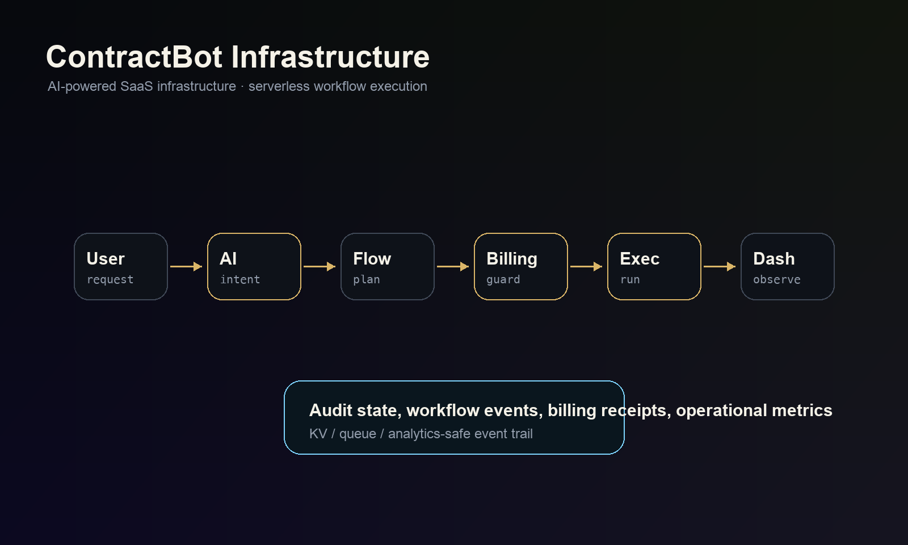

# ContractBot Showcase — by Inna Kragh

AI Workflow Infrastructure & SaaS Execution Systems

This repository is a curated public engineering showcase by Inna Kragh. It demonstrates architecture patterns, simplified Workers, billing event handling, workflow orchestration, and audit-ready automation without exposing production internals.

## Founder

Built and curated by Inna Kragh  
Founder of ContractBot  
AI Systems Architect focused on workflow infrastructure, execution systems, and compliance-aware SaaS automation.

- ContractBot: [contractbot.eu](https://contractbot.eu)
- LinkedIn: [Inna Kragh](https://linkedin.com/in/inna-kragh-1151a526b)
- ORCID: [0009-0008-3249-4179](https://orcid.org/0009-0008-3249-4179)

## Video Showcase

GitHub does not always render MP4 previews inline, so this repository includes lightweight GIF preview cards plus direct demo links. Open `index.html` for the full cinematic showcase page with muted autoplay video, custom sound toggles, dark infrastructure cards, and non-cropping `object-fit: contain` presentation.

<table>
  <tr>
    <td width="50%">
      <a href="videos/contractbot-quick-demo.mp4">
        
      </a>
      <h3>AI Workflow Infrastructure Demo</h3>
      <p>Primary product walkthrough showing workflow execution, infrastructure positioning, and SaaS operations flow.</p>
      <p><a href="videos/contractbot-quick-demo.mp4"><strong>Watch Demo</strong></a></p>
    </td>
    <td width="50%">
      <a href="videos/eu-cross-border-legal-infrastructure.mp4">
        
      </a>
      <h3>EU Cross-Border Systems Architecture</h3>
      <p>Infrastructure briefing for connected legal, operational, billing, and evidence workflows across EU-facing systems.</p>
      <p><a href="videos/eu-cross-border-legal-infrastructure.mp4"><strong>Watch Demo</strong></a></p>
    </td>
  </tr>
  <tr>
    <td width="50%">
      <a href="videos/ai-legal-workflow-consulting.mp4">
        
      </a>
      <h3>AI Workflow Infrastructure</h3>
      <p>Shows AI-assisted orchestration for operations, compliance, revenue systems, and execution-layer automation.</p>
      <p><a href="videos/ai-legal-workflow-consulting.mp4"><strong>Watch Demo</strong></a></p>
    </td>
    <td width="50%">
      <a href="videos/premium-legaltech-advisory.mp4">
        
      </a>
      <h3>Executive Infrastructure Advisory</h3>
      <p>Positions advisory work as system architecture, compliance infrastructure, and premium operational automation.</p>
      <p><a href="videos/premium-legaltech-advisory.mp4"><strong>Watch Demo</strong></a></p>
    </td>
  </tr>
  <tr>
    <td width="50%">
      <a href="videos/eidas-eudi-implementation-strategy.mp4">
        
      </a>
      <h3>Digital Trust & EUDI Readiness</h3>
      <p>Explains identity readiness, verification surfaces, and trust infrastructure for regulated workflow systems.</p>
      <p><a href="videos/eidas-eudi-implementation-strategy.mp4"><strong>Watch Demo</strong></a></p>
    </td>
    <td width="50%">
      <a href="index.html">
        
      </a>
      <h3>Cinematic Showcase Page</h3>
      <p>Static premium presentation layer for viewing the complete video set outside GitHub's MP4 preview limitations.</p>
      <p><a href="index.html"><strong>Open Showcase Page</strong></a></p>
    </td>
  </tr>
</table>

## Features

- AI workflow orchestration
- Cloudflare Workers infrastructure
- Stripe billing integration
- Execution-layer architecture
- Analytics pipelines
- Compliance-aware automation
- Audit-ready workflows

## Stack

- JavaScript
- Cloudflare Workers
- Stripe API
- KV storage
- REST APIs
- Serverless execution

## Architecture




## Workflow Flow

The showcase flow models a production-style execution system without exposing proprietary enforcement logic:

```text
User
  -> AI Layer
  -> Workflow Engine
  -> Billing
  -> Execution Layer
  -> Audit Logging
  -> Dashboard
```

## Demo Modules

- Worker API example
- Webhook validation demo
- Workflow orchestrator
- Compliance validation example

## Visual Assets

- `architecture/architecture.png` — system architecture overview.
- `screenshots/workflow-diagram.png` — workflow infrastructure flow.
- `screenshots/billing-flow.png` — billing and entitlement flow.
- `screenshots/execution-layer.png` — execution layer boundary.
- `screenshots/dashboard-preview.png` — infrastructure dashboard preview.
- `previews/*.jpg` — lightweight static thumbnails for portfolio previews.
- `previews/*.gif` — animated GitHub README previews for the video cards.

## Documentation

- `docs/API_OVERVIEW.md`
- `docs/BILLING_ARCHITECTURE.md`
- `docs/EXECUTION_LAYER.md`
- `docs/SECURITY.md`

## Security

- Production secrets are excluded.
- Sanitized infrastructure only.
- Showcase-only architecture.
- Protected operational logic and proprietary enforcement systems are intentionally omitted.

## GitHub Showcase

Suggested repository description:

> AI-powered SaaS infrastructure and workflow execution systems by Inna Kragh, built on Cloudflare Workers, Stripe, KV, and API-first automation.

Suggested topics:

`saas`, `cloudflare-workers`, `stripe`, `serverless`, `ai-workflows`, `automation`, `api-integration`, `workflow-engine`, `compliance`, `legaltech`

Profile positioning:

> Inna Kragh is an AI Systems Architect building workflow infrastructure, SaaS execution systems, and API-first automation on Cloudflare Workers and Stripe.

Pinned repo recommendation:

Pin this repository as a public technical storefront for SaaS infrastructure work. Keep production repositories private.

## Status

Active infrastructure R&D showcase.

## Disclaimer

This repository intentionally excludes proprietary production infrastructure and operational enforcement systems.
