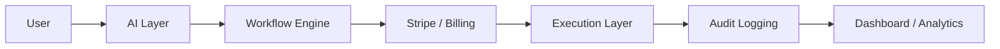

# ContractBot Showcase Infrastructure

AI-powered workflow infrastructure and SaaS execution systems built with Cloudflare Workers, Stripe and API-first automation.

This repository is a curated public engineering showcase. It demonstrates architecture patterns, simplified Workers, billing event handling, workflow orchestration, and audit-ready automation without exposing production internals.

## Showcase Preview

Open `index.html` for a cinematic video presentation layer:

- Hero video: `videos/contractbot-quick-demo.mp4`
- Systems architecture: `videos/eu-cross-border-legal-infrastructure.mp4`
- AI workflow infrastructure: `videos/ai-legal-workflow-consulting.mp4`
- Executive infrastructure advisory: `videos/premium-legaltech-advisory.mp4`
- Digital trust: `videos/eidas-eudi-implementation-strategy.mp4`

The page uses muted autoplay video, responsive dark infrastructure cards, and non-cropping `object-fit: contain` video presentation.

## Features

- AI workflow orchestration
- Cloudflare Workers infrastructure
- Stripe billing integration
- Execution-layer architecture
- Analytics pipelines
- Compliance-aware automation
- Audit-ready workflows

## Stack

- JavaScript
- Cloudflare Workers
- Stripe API
- KV storage
- REST APIs
- Serverless execution

## Architecture




## Workflow Flow

The showcase flow models a production-style execution system without exposing proprietary enforcement logic:

```text
User
  -> AI Layer
  -> Workflow Engine
  -> Billing
  -> Execution Layer
  -> Audit Logging
  -> Dashboard
```

## Demo Modules

- Worker API example
- Webhook validation demo
- Workflow orchestrator
- Compliance validation example

## Visual Assets

- `architecture/architecture.png` — system architecture overview.
- `screenshots/workflow-diagram.png` — workflow infrastructure flow.
- `screenshots/billing-flow.png` — billing and entitlement flow.
- `screenshots/execution-layer.png` — execution layer boundary.
- `screenshots/dashboard-preview.png` — infrastructure dashboard preview.
- `previews/*.jpg` — lightweight video thumbnails for portfolio previews.

## Documentation

- `docs/API_OVERVIEW.md`
- `docs/BILLING_ARCHITECTURE.md`
- `docs/EXECUTION_LAYER.md`
- `docs/SECURITY.md`

## Security

- Production secrets are excluded.
- Sanitized infrastructure only.
- Showcase-only architecture.
- Protected operational logic and proprietary enforcement systems are intentionally omitted.

## GitHub Showcase

Suggested repository description:

> AI-powered SaaS infrastructure and workflow execution systems built on Cloudflare Workers, Stripe, KV, and API-first automation.

Suggested topics:

`saas`, `cloudflare-workers`, `stripe`, `serverless`, `ai-workflows`, `automation`, `api-integration`, `workflow-engine`, `compliance`, `legaltech`

Profile positioning:

> AI Systems Architect building workflow infrastructure, SaaS execution systems, and API-first automation on Cloudflare Workers and Stripe.

Pinned repo recommendation:

Pin this repository as a public technical storefront for SaaS infrastructure work. Keep production repositories private.

## Status

Active infrastructure R&D showcase.

## Disclaimer

This repository intentionally excludes proprietary production infrastructure and operational enforcement systems.
